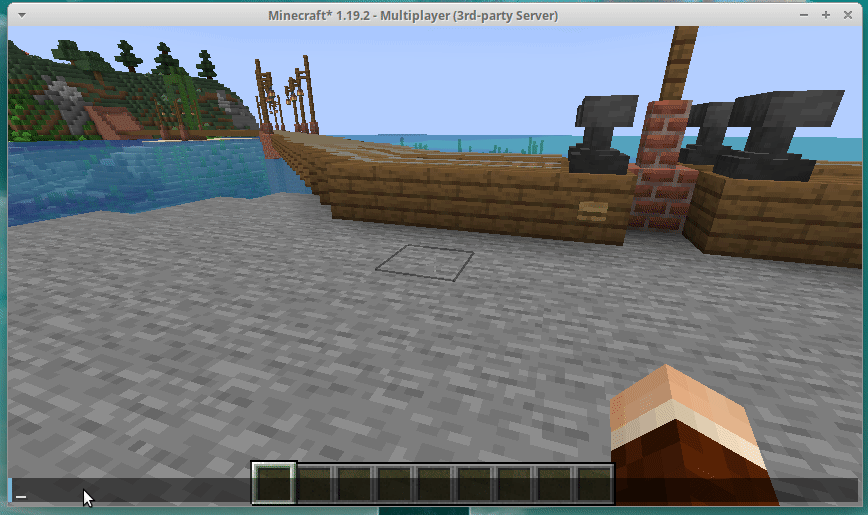
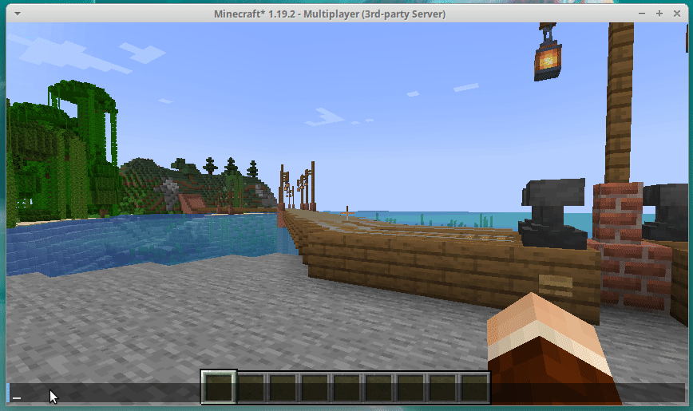

# Usage

## Command reference

### /cartjets

Opens the interactive menu.

### /cartjets-setupwizard

Creates a new CartJets line.

### /cartjets-list

Gets a list of all CartJets lines.

### /cartjets-delete

Open the PostBox of that specific player.

### /cartjets-update

Checks for an updated version of the plugin.

## Interactions

### Clicking a CartJets line button

Player takes a ride.
